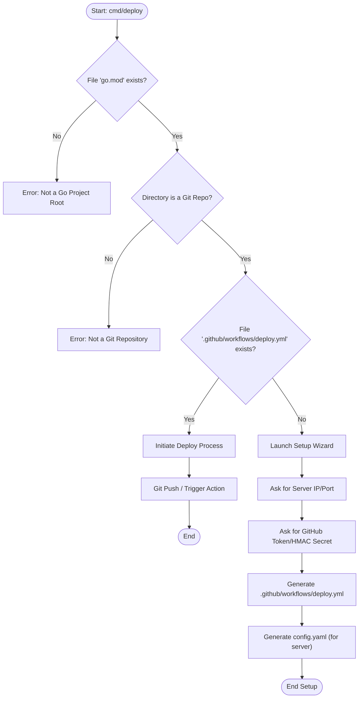

# CLI Workflow

This diagram illustrates the decision process for the developer CLI tool (`cmd/deploy`).

```mermaid
flowchart TD
    Start([Start: cmd/deploy]) --> CheckGo{File 'go.mod' exists?}
    CheckGo -- No --> ErrorGo[Error: Not a Go Project Root]
    CheckGo -- Yes --> CheckGit{Directory is a Git Repo?}

    CheckGit -- No --> ErrorGit[Error: Not a Git Repository]
    CheckGit -- Yes --> CheckAction{File '.github/workflows/deploy.yml' exists?}

    CheckAction -- Yes --> DeployProcess[Initiate Deploy Process]
    DeployProcess --> PushCode[Git Push / Trigger Action]
    PushCode --> End([End])

    CheckAction -- No --> Wizard[Launch Setup Wizard]
    Wizard --> InputConfig[Ask for Server IP/Port]
    InputConfig --> InputSecrets[Ask for GitHub Token/HMAC Secret]
    InputSecrets --> GenAction[Generate .github/workflows/deploy.yml]
    GenAction --> GenConfig["Generate config.yaml (for server)"]
    GenConfig --> EndWizard([End Setup])
```
