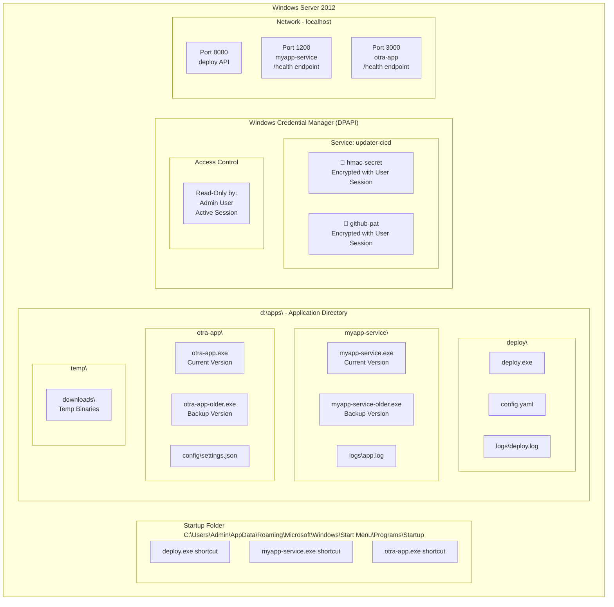

# System Components

```mermaid
graph TB
    subgraph "Windows Server 2012"
        subgraph "Startup Folder<br/>C:\Users\Admin\AppData\Roaming\Microsoft\Windows\Start Menu\Programs\Startup"
            SF1[deploy.exe shortcut]
            SF2[myapp-service.exe shortcut]
            SF3[otra-app.exe shortcut]
        end
        
        subgraph "d:\apps\ - Application Directory"
            subgraph "deploy\"
                UP1[deploy.exe]
                UP2[config.yaml]
                UP3[logs\deploy.log]
            end
            
            subgraph "myapp-service\"
                MP1[myapp-service.exe<br/>Current Version]
                MP2[myapp-service-older.exe<br/>Backup Version]
                MP3[logs\app.log]
            end
            
            subgraph "otra-app\"
                OA1[otra-app.exe<br/>Current Version]
                OA2[otra-app-older.exe<br/>Backup Version]
                OA3[config\settings.json]
            end
            
            subgraph "temp\"
                TMP1[downloads\<br/>Temp Binaries]
            end
        end
        
        subgraph "Windows Credential Manager (DPAPI)"
            subgraph "Service: updater-cicd"
                KR1[🔑 hmac-secret<br/>Encrypted with User Session]
                KR2[🔑 github-pat<br/>Encrypted with User Session]
            end
            
            subgraph "Access Control"
                KRA[Read-Only by:<br/>Admin User<br/>Active Session]
            end
        end
        
        subgraph "Network - localhost"
            NET1[Port 8080<br/>deploy API]
            NET2[Port 1200<br/>myapp-service<br/>/health endpoint]
            NET3[Port 3000<br/>otra-app<br/>/health endpoint]
        end
    end
```
