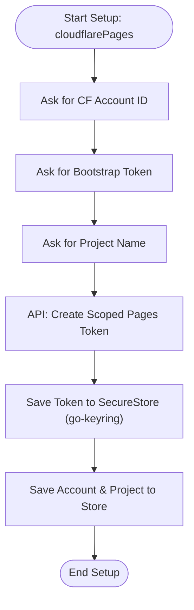
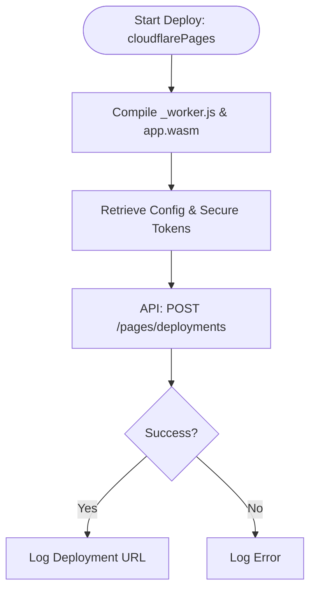

# Cloudflare Pages Deployment Flow

This diagram illustrates the setup and deployment process for Cloudflare Pages.

## 1. Setup Phase

```mermaid
flowchart TD
    StartSetup([Start Setup: cloudflarePages]) --> InputAccount[Ask for CF Account ID]
    InputAccount --> InputToken[Ask for Bootstrap Token]
    InputToken --> InputProject[Ask for Project Name]
    
    InputProject --> ApiCall[API: Create Scoped Pages Token]
    ApiCall --> SaveSecure["Save Token to SecureStore (go-keyring)"]
    SaveSecure --> SaveKvdb[Save Account & Project to Store]
    SaveKvdb --> EndSetup([End Setup])
```

## 2. Deploy Execution

```mermaid
flowchart TD
    StartDeploy([Start Deploy: cloudflarePages]) --> Compile[Compile _worker.js & app.wasm]
    Compile --> GetSecure[Retrieve Config & Secure Tokens]
    GetSecure --> ApiDeploy[API: POST /pages/deployments]
    
    ApiDeploy --> Result{Success?}
    Result -- Yes --> Success[Log Deployment URL]
    Result -- No --> Error[Log Error]
```
