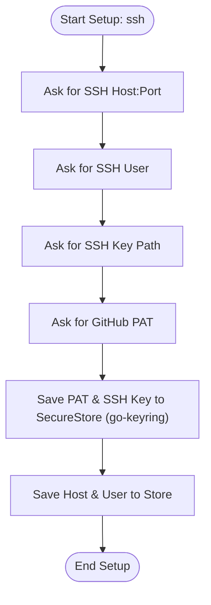
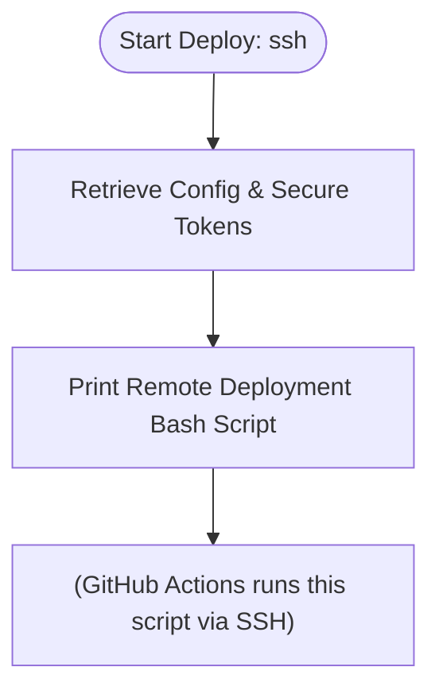

# SSH Deployment Flow

This diagram illustrates the setup and deployment process for SSH deployments.

## 1. Setup Phase (Local)

```mermaid
flowchart TD
    StartSetup([Start Setup: ssh]) --> InputHost[Ask for SSH Host:Port]
    InputHost --> InputUser[Ask for SSH User]
    InputUser --> InputKey[Ask for SSH Key Path]
    InputKey --> InputPAT["Ask for GitHub PAT"]
    
    InputPAT --> SaveSecure["Save PAT & SSH Key to SecureStore (go-keyring)"]
    SaveSecure --> SaveKvdb[Save Host & User to Store]
    SaveKvdb --> EndSetup([End Setup])
```

## 2. Generate Script (Local or CI)

```mermaid
flowchart TD
    StartDeploy([Start Deploy: ssh]) --> GetConfig["Retrieve Config & Secure Tokens"]
    GetConfig --> GenScript["Print Remote Deployment Bash Script"]
    GenScript --> InstructUser["(GitHub Actions runs this script via SSH)"]
```
