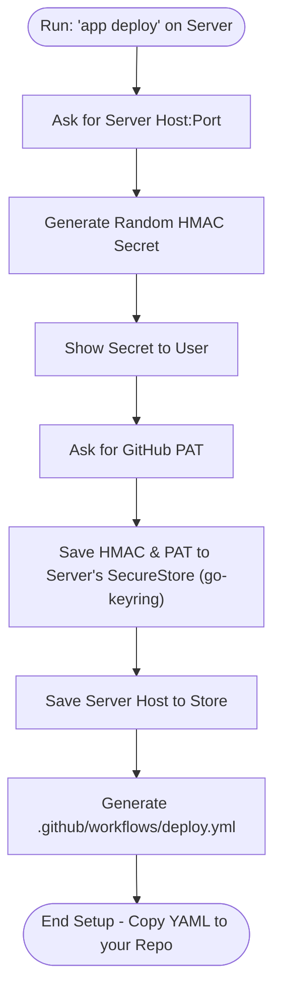
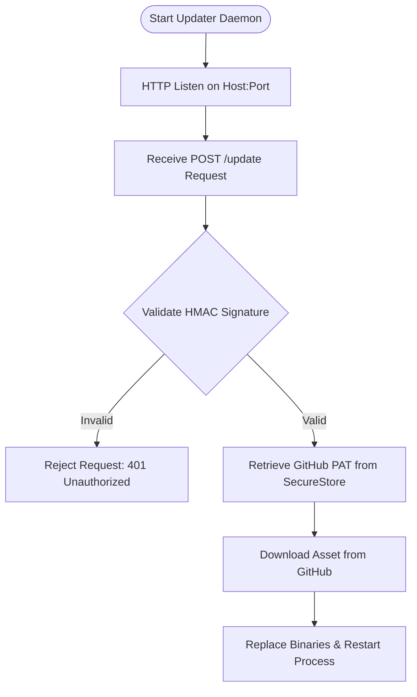

## 1. Server Setup Phase (Run `deploy.exe` on Remote Server)

```mermaid
flowchart TD
    StartSetup([Run: 'app deploy' on Server]) --> InputHost[Ask for Server Host:Port]
    InputHost --> GenSecret["Generate Random HMAC Secret"]
    GenSecret --> DisplaySecret["Show Secret to User"]
    DisplaySecret --> InputPAT["Ask for GitHub PAT"]
    
    InputPAT --> SaveSecure["Save HMAC & PAT to Server's SecureStore (go-keyring)"]
    SaveSecure --> SaveKvdb[Save Server Host to Store]
    SaveKvdb --> GenerateCI["Generate .github/workflows/deploy.yml"]
    GenerateCI --> EndSetup([End Setup - Copy YAML to your Repo])
```

## 2. Server Daemon (Runs continuously on Remote Server)

```mermaid
flowchart TD
    StartDeploy([Start Updater Daemon]) --> Listen["HTTP Listen on Host:Port"]
    Listen --> Receive["Receive POST /update Request"]
    Receive --> VerifyHMAC{"Validate HMAC Signature"}
    
    VerifyHMAC -- Invalid --> Error["Reject Request: 401 Unauthorized"]
    VerifyHMAC -- Valid --> GetPAT["Retrieve GitHub PAT from SecureStore"]
    
    GetPAT --> Download["Download Asset from GitHub"]
    Download --> Restart["Replace Binaries & Restart Process"]
```
