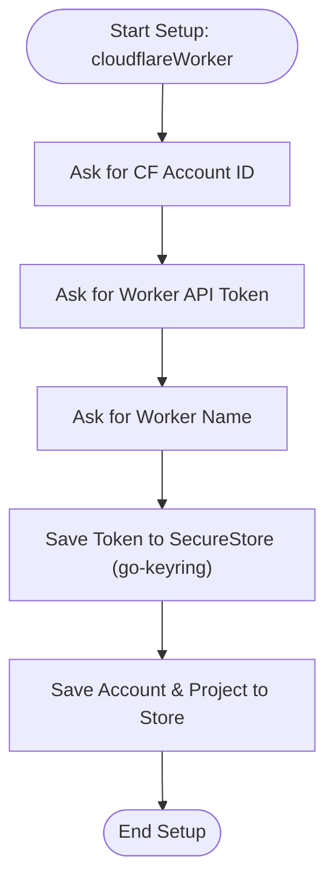
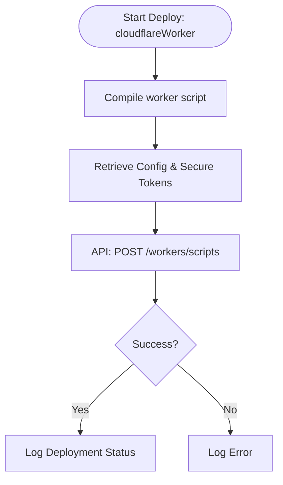

# Cloudflare Workers Deployment Flow

This diagram illustrates the setup and deployment process for Cloudflare Workers.

## 1. Setup Phase

```mermaid
flowchart TD
    StartSetup([Start Setup: cloudflareWorker]) --> InputAccount[Ask for CF Account ID]
    InputAccount --> InputToken[Ask for Worker API Token]
    InputToken --> InputProject[Ask for Worker Name]
    
    InputProject --> SaveSecure["Save Token to SecureStore (go-keyring)"]
    SaveSecure --> SaveKvdb[Save Account & Project to Store]
    SaveKvdb --> EndSetup([End Setup])
```

## 2. Deploy Execution

```mermaid
flowchart TD
    StartDeploy([Start Deploy: cloudflareWorker]) --> Compile["Compile worker script"]
    Compile --> GetSecure["Retrieve Config & Secure Tokens"]
    GetSecure --> ApiDeploy["API: POST /workers/scripts"]
    
    ApiDeploy --> Result{Success?}
    Result -- Yes --> Success[Log Deployment Status]
    Result -- No --> Error[Log Error]
```
