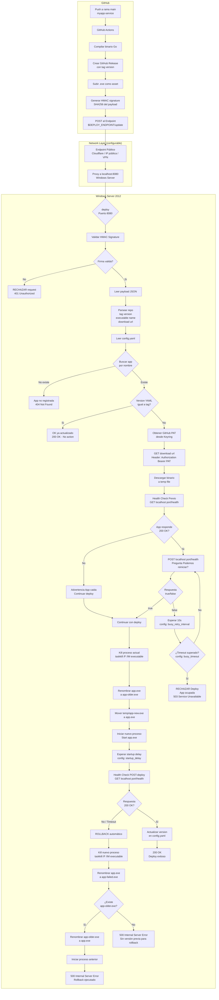

# Process Flow

```mermaid
graph TB
    subgraph "GitHub"
        A[Push a rama main<br/>myapp-service] --> B[GitHub Actions]
        B --> C[Compilar binario Go]
        C --> D[Crear GitHub Release<br/>con tag version]
        D --> E[Subir .exe como asset]
        E --> F[Generar HMAC signature<br/>SHA256 del payload]
        F --> G[POST al Endpoint<br/>$DEPLOY_ENDPOINT/update]
    end
    
    subgraph "Network Layer (configurable)"
        G --> H[Endpoint Público<br/>Cloudflare / IP pública / VPN]
        H --> I[Proxy a localhost:8080<br/>Windows Server]
    end
    
    subgraph "Windows Server 2012"
        I --> J{deploy<br/>Puerto 8080}
        
        J --> K[Validar HMAC Signature]
        K --> K1{Firma valida?}
        K1 -->|No| K2[RECHAZAR request<br/>401 Unauthorized]
        K1 -->|Si| L[Leer payload JSON]

        L --> M[Parsear repo<br/>tag version<br/>executable name<br/>download url]
        M --> N[Leer config.yaml]
        N --> O{Buscar app<br/>por nombre}
        
        O -->|No existe| P[App no registrada<br/>404 Not Found]
        O -->|Existe| Q{Version YAML<br/>igual a tag?}

        Q -->|Si| R[OK ya actualizado<br/>200 OK - No action]
        Q -->|No| S[Obtener GitHub PAT<br/>desde Keyring]

        S --> T[GET download url<br/>Header: Authorization Bearer PAT]
        T --> U[Descargar binario<br/>a temp file]

        U --> V[Health Check Previo<br/>GET localhost port/health]
        V --> W{App responde<br/>200 OK?}
        W -->|No| X[Advertencia App caida<br/>Continuar deploy]
        W -->|Si| Y[POST localhost port/health<br/>Pregunta Podemos reiniciar?]

        Y --> Z{Respuesta<br/>true/false}
        Z -->|true| AB[Continuar con deploy]
        X --> AB

        Z -->|false| Z1[Esperar 10s<br/>config: busy_retry_interval]
        Z1 --> Z2{¿Timeout superado?<br/>config: busy_timeout}
        Z2 -->|No| Y
        Z2 -->|Sí| AA[RECHAZAR Deploy<br/>App ocupada<br/>503 Service Unavailable]

        AB --> AC[Kill proceso actual<br/>taskkill /F /IM executable]
        AC --> AD[Renombrar app.exe<br/>a app-older.exe]
        AD --> AE[Mover temp/app-new.exe<br/>a app.exe]
        AE --> AF[Iniciar nuevo proceso<br/>Start app.exe]
        AF --> AG[Esperar startup delay<br/>config: startup_delay]
        
        AG --> AH[Health Check POST-deploy<br/>GET localhost port/health]
        AH --> AI{Respuesta<br/>200 OK?}

        AI -->|No / Timeout| AJ[ROLLBACK automático]
        AJ --> AK[Kill nuevo proceso<br/>taskkill /F /IM executable]
        AK --> AL[Renombrar app.exe<br/>a app-failed.exe]
        AL --> AL1{¿Existe<br/>app-older.exe?}
        
        AL1 -->|Sí| AM[Renombrar app-older.exe<br/>a app.exe]
        AM --> AN[Iniciar proceso anterior]
        AN --> AO[500 Internal Server Error<br/>Rollback ejecutado]
        
        AL1 -->|No| AL2[500 Internal Server Error<br/>Sin versión previa para rollback]

        AI -->|Sí| AP[Actualizar version<br/>en config.yaml]
        AP --> AQ[200 OK<br/>Deploy exitoso]
    end
```
