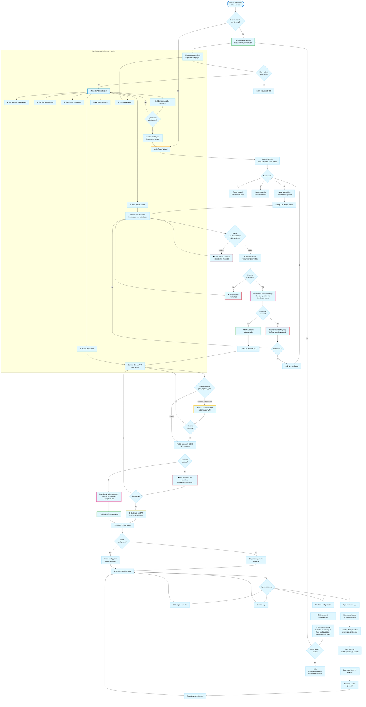

# Updater Setup Flow

```mermaid
flowchart TD
    START([Ejecutar deploy.exe<br/>Primera vez])
    
    START --> CHECK{Existen secretos<br/>en Keyring?}
    
    CHECK -->|Sí| NORMAL[Modo servicio normal<br/>Escuchar en puerto 8080]
    CHECK -->|No| SETUP[Modo Setup Wizard]
    
    SETUP --> BANNER[Mostrar banner:<br/>DEPLOY - First Time Setup]
    
    BANNER --> MENU{Menú inicial}
    
    MENU -->|1| AUTO[Setup automático<br/>Configuración guiada]
    MENU -->|2| MANUAL[Setup manual<br/>Editar config.yaml]
    MENU -->|3| HELP[Mostrar ayuda<br/>y documentación]
    MENU -->|0| EXIT[Salir sin configurar]
    
    AUTO --> STEP1[📌 Step 1/3: HMAC Secret]
    
    STEP1 --> INPUT1[Solicitar HMAC secret<br/>Input oculto con asteriscos]
    INPUT1 --> VALID1{Validar:<br/>Min 32 caracteres<br/>Alfanumérico}
    
    VALID1 -->|Inválido| ERR1[❌ Error: Secret too short<br/>o caracteres inválidos]
    ERR1 --> INPUT1
    
    VALID1 -->|Válido| CONFIRM1[Confirmar secret<br/>Reingresar para validar]
    CONFIRM1 --> MATCH1{Secrets<br/>coinciden?}
    
    MATCH1 -->|No| ERR2[❌ No coinciden<br/>Reintentar]
    ERR2 --> INPUT1
    
    MATCH1 -->|Sí| SAVE1[Guardar via webtyp/keyring:<br/>Service: updater-cicd<br/>Key: hmac-secret]
    
    SAVE1 --> CHECK_SAVE1{Guardado<br/>exitoso?}
    CHECK_SAVE1 -->|No| ERR3[❌ Error acceso Keyring<br/>Verificar permisos usuario]
    ERR3 --> RETRY1{Reintentar?}
    RETRY1 -->|Sí| INPUT1
    RETRY1 -->|No| EXIT
    
    CHECK_SAVE1 -->|Sí| SUCCESS1[✓ HMAC secret almacenado]
    
    SUCCESS1 --> STEP2[📌 Step 2/3: GitHub PAT]
    
    STEP2 --> INPUT2[Solicitar GitHub PAT<br/>Input oculto]
    INPUT2 --> VALID2{Validar formato:<br/>ghp_ o github_pat_}
    
    VALID2 -->|Formato sospechoso| WARN1[⚠️ Token no parece PAT<br/>¿Continuar? y/N]
    WARN1 --> CONTINUE1{Usuario<br/>confirma?}
    CONTINUE1 -->|No| INPUT2
    CONTINUE1 -->|Sí| TEST_PAT
    
    VALID2 -->|Válido| TEST_PAT[Probar conexión GitHub<br/>GET /user API]
    
    TEST_PAT --> TEST_RESULT{Conexión<br/>exitosa?}
    
    TEST_RESULT -->|No| ERR4[❌ PAT inválido o sin permisos<br/>Requiere scope: repo]
    ERR4 --> RETRY2{Reintentar?}
    RETRY2 -->|Sí| INPUT2
    RETRY2 -->|No| SKIP_PAT[⚠️ Continuar sin PAT<br/>Solo repos públicos]
    
    TEST_RESULT -->|Sí| SAVE2[Guardar via webtyp/keyring:<br/>Service: updater-cicd<br/>Key: github-pat]
    SKIP_PAT --> STEP3
    
    SAVE2 --> SUCCESS2[✓ GitHub PAT almacenado]
    
    SUCCESS2 --> STEP3[📌 Step 3/3: Config YAML]
    
    STEP3 --> YAML_CHECK{Existe<br/>config.yaml?}
    
    YAML_CHECK -->|Sí| YAML_LOAD[Cargar configuración<br/>existente]
    YAML_CHECK -->|No| YAML_CREATE[Crear config.yaml<br/>desde template]
    
    YAML_LOAD --> YAML_SHOW[Mostrar apps registradas]
    YAML_CREATE --> YAML_SHOW
    
    YAML_SHOW --> YAML_MENU{Opciones config}
    
    YAML_MENU -->|1| YAML_ADD[Agregar nueva app]
    YAML_MENU -->|2| YAML_EDIT[Editar app existente]
    YAML_MENU -->|3| YAML_DELETE[Eliminar app]
    YAML_MENU -->|4| YAML_DONE[Finalizar configuración]
    
    YAML_ADD --> APP_NAME[Nombre de la app:<br/>ej: myapp-service]
    APP_NAME --> APP_EXE[Nombre del ejecutable:<br/>ej: myapp-service.exe]
    APP_EXE --> APP_PATH[Path absoluto:<br/>ej: d:\apps\myapp-service]
    APP_PATH --> APP_PORT[Puerto del servicio:<br/>ej: 1200]
    APP_PORT --> APP_HEALTH[Endpoint health:<br/>ej: /health]
    APP_HEALTH --> APP_SAVE[Guardar en config.yaml]
    APP_SAVE --> YAML_SHOW
    
    YAML_EDIT --> YAML_SHOW
    YAML_DELETE --> YAML_SHOW
    
    YAML_DONE --> FINAL_SUMMARY[📋 Resumen de configuración]
    
    FINAL_SUMMARY --> SUMMARY_DISPLAY["✅ Setup completado<br/>Secretos en Keyring ✓<br/>Apps configuradas: 2<br/>Puerto updater: 8080"]
    
    SUMMARY_DISPLAY --> START_SERVICE{Iniciar servicio<br/>ahora?}
    
    START_SERVICE -->|Sí| NORMAL
    START_SERVICE -->|No| EXIT_PENDING[Salir<br/>Ejecutar deploy.exe<br/>para iniciar servicio]
    
    NORMAL --> LISTEN[Escuchando en :8080<br/>Esperando deploys...]
    
    LISTEN --> ADMIN_CHECK{Flag --admin<br/>detectado?}
    ADMIN_CHECK -->|Sí| ADMIN_MENU
    ADMIN_CHECK -->|No| SERVE[Servir requests HTTP]
    
    subgraph "Admin Menu (deploy.exe --admin)"
        ADMIN_MENU[Menú de Administración]
        ADMIN_MENU --> ADM1[1. Ver secretos mascarados]
        ADMIN_MENU --> ADM2[2. Rotar HMAC secret]
        ADMIN_MENU --> ADM3[3. Rotar GitHub PAT]
        ADMIN_MENU --> ADM4[4. Test GitHub conexión]
        ADMIN_MENU --> ADM5[5. Test HMAC validación]
        ADMIN_MENU --> ADM6[6. Eliminar todos los secretos]
        ADMIN_MENU --> ADM7[7. Ver logs recientes]
        ADMIN_MENU --> ADM8[0. Volver al servicio]
        
        ADM2 --> INPUT1
        ADM3 --> INPUT2
        ADM6 --> CONFIRM_DELETE{¿Confirmar<br/>eliminación?}
        CONFIRM_DELETE -->|Sí| DELETE_ALL[Eliminar del Keyring<br/>Requiere re-setup]
        DELETE_ALL --> SETUP
        CONFIRM_DELETE -->|No| ADMIN_MENU
        ADM8 --> LISTEN
    end
    
    style START fill:#e0f7ff,stroke:#0066cc,stroke-width:2px,color:#000
    style SETUP fill:#e0f7ff,stroke:#ff9800,stroke-width:2px,color:#000
    style SUCCESS1 fill:#e0f7ff,stroke:#28a745,stroke-width:2px,color:#000
    style SUCCESS2 fill:#e0f7ff,stroke:#28a745,stroke-width:2px,color:#000
    style NORMAL fill:#e0f7ff,stroke:#28a745,stroke-width:2px,color:#000
    style ERR1 fill:#e0f7ff,stroke:#dc3545,stroke-width:2px,color:#000
    style ERR2 fill:#e0f7ff,stroke:#dc3545,stroke-width:2px,color:#000
    style ERR3 fill:#e0f7ff,stroke:#dc3545,stroke-width:2px,color:#000
    style ERR4 fill:#e0f7ff,stroke:#dc3545,stroke-width:2px,color:#000
    style WARN1 fill:#e0f7ff,stroke:#ffc107,stroke-width:2px,color:#000
    style SKIP_PAT fill:#e0f7ff,stroke:#ffc107,stroke-width:2px,color:#000
    style ADMIN_MENU fill:#e0f7ff,stroke:#0288d1,stroke-width:2px,color:#000
    style SAVE1 fill:#e0f7ff,stroke:#e83e8c,stroke-width:2px,color:#000
    style SAVE2 fill:#e0f7ff,stroke:#e83e8c,stroke-width:2px,color:#000
    style MENU fill:#e0f7ff,stroke:#b3e5fc,stroke-width:2px,color:#000
    style VALID1 fill:#e0f7ff,stroke:#b3e5fc,stroke-width:2px,color:#000
    style VALID2 fill:#e0f7ff,stroke:#b3e5fc,stroke-width:2px,color:#000
    style MATCH1 fill:#e0f7ff,stroke:#b3e5fc,stroke-width:2px,color:#000
    style CHECK_SAVE1 fill:#e0f7ff,stroke:#b3e5fc,stroke-width:2px,color:#000
    style RETRY1 fill:#e0f7ff,stroke:#b3e5fc,stroke-width:2px,color:#000
    style CONTINUE1 fill:#e0f7ff,stroke:#b3e5fc,stroke-width:2px,color:#000
    style TEST_RESULT fill:#e0f7ff,stroke:#b3e5fc,stroke-width:2px,color:#000
    style RETRY2 fill:#e0f7ff,stroke:#b3e5fc,stroke-width:2px,color:#000
    style STEP1 fill:#e0f7ff,stroke:#b3e5fc,stroke-width:2px,color:#000
    style STEP2 fill:#e0f7ff,stroke:#b3e5fc,stroke-width:2px,color:#000
    style STEP3 fill:#e0f7ff,stroke:#b3e5fc,stroke-width:2px,color:#000
    style INPUT1 fill:#e0f7ff,stroke:#b3e5fc,stroke-width:2px,color:#000
    style INPUT2 fill:#e0f7ff,stroke:#b3e5fc,stroke-width:2px,color:#000
    style CONFIRM1 fill:#e0f7ff,stroke:#b3e5fc,stroke-width:2px,color:#000
    style TEST_PAT fill:#e0f7ff,stroke:#b3e5fc,stroke-width:2px,color:#000
    style YAML_CHECK fill:#e0f7ff,stroke:#b3e5fc,stroke-width:2px,color:#000
    style YAML_LOAD fill:#e0f7ff,stroke:#b3e5fc,stroke-width:2px,color:#000
    style YAML_CREATE fill:#e0f7ff,stroke:#b3e5fc,stroke-width:2px,color:#000
    style YAML_SHOW fill:#e0f7ff,stroke:#b3e5fc,stroke-width:2px,color:#000
    style YAML_MENU fill:#e0f7ff,stroke:#b3e5fc,stroke-width:2px,color:#000
    style YAML_ADD fill:#e0f7ff,stroke:#b3e5fc,stroke-width:2px,color:#000
    style YAML_EDIT fill:#e0f7ff,stroke:#b3e5fc,stroke-width:2px,color:#000
    style YAML_DELETE fill:#e0f7ff,stroke:#b3e5fc,stroke-width:2px,color:#000
    style YAML_DONE fill:#e0f7ff,stroke:#b3e5fc,stroke-width:2px,color:#000
    style APP_NAME fill:#e0f7ff,stroke:#b3e5fc,stroke-width:2px,color:#000
    style APP_EXE fill:#e0f7ff,stroke:#b3e5fc,stroke-width:2px,color:#000
    style APP_PATH fill:#e0f7ff,stroke:#b3e5fc,stroke-width:2px,color:#000
    style APP_PORT fill:#e0f7ff,stroke:#b3e5fc,stroke-width:2px,color:#000
    style APP_HEALTH fill:#e0f7ff,stroke:#b3e5fc,stroke-width:2px,color:#000
    style APP_SAVE fill:#e0f7ff,stroke:#b3e5fc,stroke-width:2px,color:#000
    style AUTO fill:#e0f7ff,stroke:#b3e5fc,stroke-width:2px,color:#000
    style MANUAL fill:#e0f7ff,stroke:#b3e5fc,stroke-width:2px,color:#000
    style HELP fill:#e0f7ff,stroke:#b3e5fc,stroke-width:2px,color:#000
    style FINAL_SUMMARY fill:#e0f7ff,stroke:#b3e5fc,stroke-width:2px,color:#000
    style SUMMARY_DISPLAY fill:#e0f7ff,stroke:#b3e5fc,stroke-width:2px,color:#000
    style START_SERVICE fill:#e0f7ff,stroke:#b3e5fc,stroke-width:2px,color:#000
    style EXIT_PENDING fill:#e0f7ff,stroke:#b3e5fc,stroke-width:2px,color:#000
    style LISTEN fill:#e0f7ff,stroke:#b3e5fc,stroke-width:2px,color:#000
    style ADMIN_CHECK fill:#e0f7ff,stroke:#b3e5fc,stroke-width:2px,color:#000
    style SERVE fill:#e0f7ff,stroke:#b3e5fc,stroke-width:2px,color:#000
    style BANNER fill:#e0f7ff,stroke:#b3e5fc,stroke-width:2px,color:#000
    style CONFIRM_DELETE fill:#e0f7ff,stroke:#b3e5fc,stroke-width:2px,color:#000
    style DELETE_ALL fill:#e0f7ff,stroke:#b3e5fc,stroke-width:2px,color:#000
    style ADM1 fill:#e0f7ff,stroke:#b3e5fc,stroke-width:2px,color:#000
    style ADM2 fill:#e0f7ff,stroke:#b3e5fc,stroke-width:2px,color:#000
    style ADM3 fill:#e0f7ff,stroke:#b3e5fc,stroke-width:2px,color:#000
    style ADM4 fill:#e0f7ff,stroke:#b3e5fc,stroke-width:2px,color:#000
    style ADM5 fill:#e0f7ff,stroke:#b3e5fc,stroke-width:2px,color:#000
    style ADM6 fill:#e0f7ff,stroke:#b3e5fc,stroke-width:2px,color:#000
    style ADM7 fill:#e0f7ff,stroke:#b3e5fc,stroke-width:2px,color:#000
    style ADM8 fill:#e0f7ff,stroke:#b3e5fc,stroke-width:2px,color:#000
    style CHECK fill:#e0f7ff,stroke:#b3e5fc,stroke-width:2px,color:#000
    style EXIT fill:#e0f7ff,stroke:#b3e5fc,stroke-width:2px,color:#000
```
