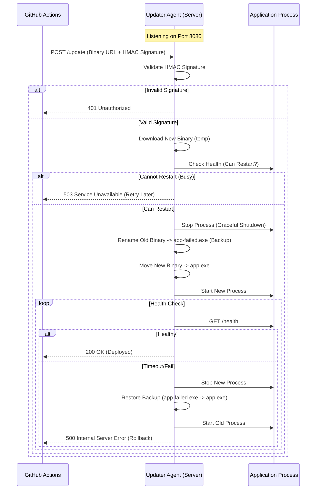

# Server Agent Workflow (Updater)

This diagram illustrates the process for the server-side agent (`cmd/updater`).

```mermaid
sequenceDiagram
    participant GH as GitHub Actions
    participant A as Updater Agent (Server)
    participant P as Application Process

    Note over A: Listening on Port 8080

    GH->>A: POST /update (Binary URL + HMAC Signature)
    A->>A: Validate HMAC Signature

    alt Invalid Signature
        A-->>GH: 401 Unauthorized
    else Valid Signature
        A->>A: Download New Binary (temp)
        A->>P: Check Health (Can Restart?)

        alt Cannot Restart (Busy)
            A-->>GH: 503 Service Unavailable (Retry Later)
        else Can Restart
            A->>P: Stop Process (Graceful Shutdown)
            A->>A: Rename Old Binary -> app-failed.exe (Backup)
            A->>A: Move New Binary -> app.exe
            A->>P: Start New Process

            loop Health Check
                A->>P: GET /health
                alt Healthy
                    A-->>GH: 200 OK (Deployed)
                else Timeout/Fail
                    A->>P: Stop New Process
                    A->>A: Restore Backup (app-failed.exe -> app.exe)
                    A->>P: Start Old Process
                    A-->>GH: 500 Internal Server Error (Rollback)
                end
            end
        end
    end
```
