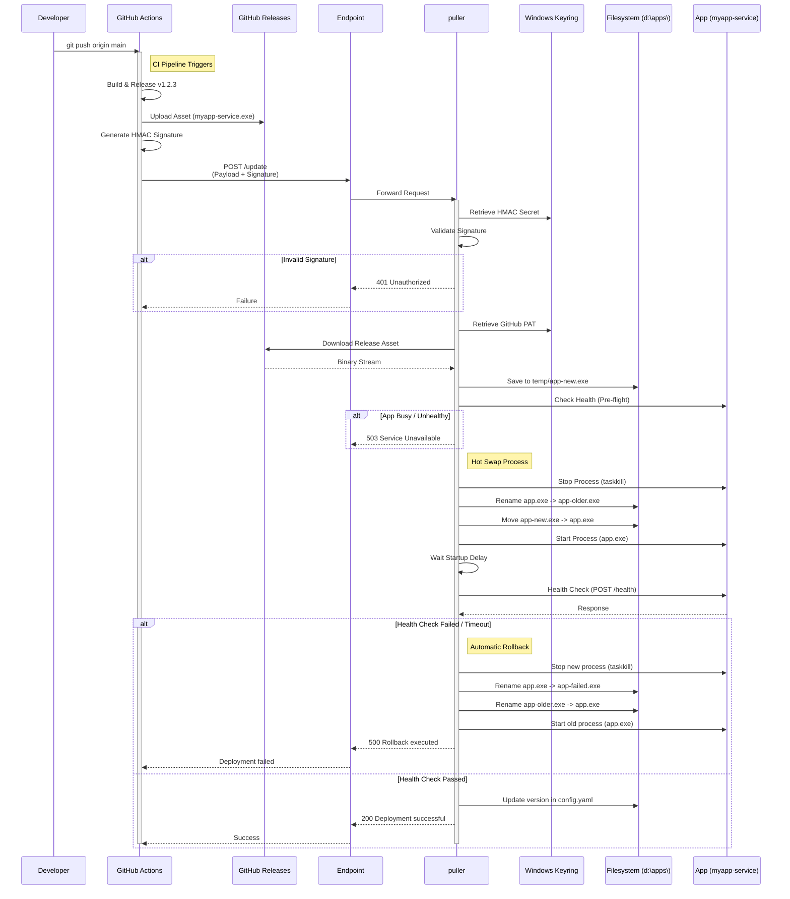

# Deployment Workflow

```mermaid
sequenceDiagram
    participant Dev as Developer
    participant GH as GitHub Actions
    participant GHR as GitHub Releases
    participant EP as Endpoint
    participant UPD as puller
    participant KR as Windows Keyring
    participant FS as Filesystem (d:\apps\)
    participant APP as App (myapp-service)

    Dev->>GH: git push origin main
    activate GH
    note right of GH: CI Pipeline Triggers
    
    GH->>GH: Build & Release v1.2.3
    GH->>GHR: Upload Asset (myapp-service.exe)
    
    GH->>GH: Generate HMAC Signature
    GH->>EP: POST /update<br/>(Payload + Signature)

    EP->>UPD: Forward Request
    activate UPD
    
    UPD->>KR: Retrieve HMAC Secret
    UPD->>UPD: Validate Signature
    
    alt Invalid Signature
        UPD-->>EP: 401 Unauthorized
        EP-->>GH: Failure
    end
    
    UPD->>KR: Retrieve GitHub PAT
    UPD->>GHR: Download Release Asset
    GHR-->>UPD: Binary Stream
    
    UPD->>FS: Save to temp/app-new.exe
    
    UPD->>APP: Check Health (Pre-flight)
    alt App Busy / Unhealthy
        UPD-->>EP: 503 Service Unavailable
    end
    
    note right of UPD: Hot Swap Process
    UPD->>APP: Stop Process (taskkill)
    UPD->>FS: Rename app.exe -> app-older.exe
    UPD->>FS: Move app-new.exe -> app.exe
    UPD->>APP: Start Process (app.exe)

    UPD->>UPD: Wait Startup Delay

    UPD->>APP: Health Check (POST /health)
    APP-->>UPD: Response

    alt Health Check Failed / Timeout
        note right of UPD: Automatic Rollback
        UPD->>APP: Stop new process (taskkill)
        UPD->>FS: Rename app.exe -> app-failed.exe
        UPD->>FS: Rename app-older.exe -> app.exe
        UPD->>APP: Start old process (app.exe)
        UPD-->>EP: 500 Rollback executed
        EP-->>GH: Deployment failed
    else Health Check Passed
        UPD->>FS: Update version in config.yaml
        UPD-->>EP: 200 Deployment successful
        EP-->>GH: Success
        deactivate UPD
        deactivate GH
    end
```
